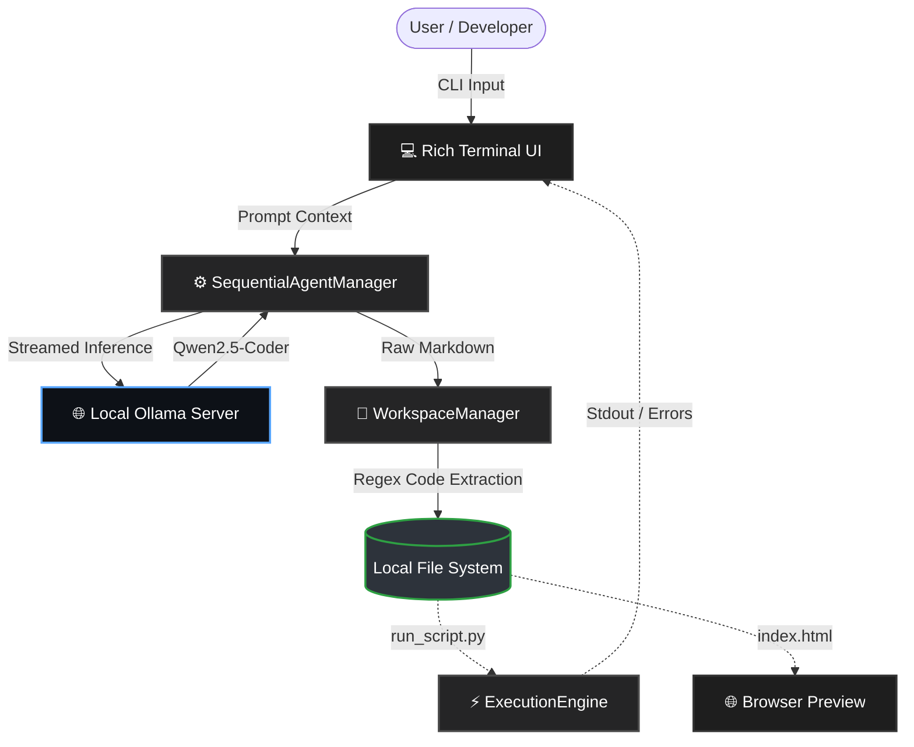

<div align="center">

# ⚡ Promptly AI

**The Definitive AI-Powered Developer Terminal & Automated Workspace Manager**


<br/>

Promptly AI is not just a chatbot—it is a complete Automated Software Development Pipeline. It integrates multi-persona AI reasoning, streaming markdown extraction, and instant local execution frameworks to provide a frictionless, end-to-end development experience right inside your terminal.

<br/>

[](https://youtu.be/sMdR-ZdWFi8)
<br/>
<br/>

</div>

## 🌟 Project Overview

Promptly AI is an intelligent **"Developer-in-a-Box."** It is built to simulate a high-performing software engineer that never sleeps. By combining modern AI orchestration with a high-speed terminal stack, it automatically guides coding tasks from casual prompts to fully executed local codebases.

This project isn't just a chatbot; it is a **complete autonomous ecosystem** that understands development intent, extracts code blocks accurately, and writes to physical directories without human oversight.

### ❓ The Problem

In modern rapid prototyping, **60-70% of developer time is lost** due to constant context switching and "copy-paste fatigue." Developers ask a web-based AI for a website structure, and then waste tedious minutes manually creating `index.html`, `styles.css`, and `script.js` files, copying over segments, and fixing syntax. Standard chat interfaces often fail because they are "fragile"—they aren't connected to the engineer's actual file system or execution environments.

### 💡 The Solution

Promptly AI solves this through **Intelligence-First Automation**:

*   **Zero-Friction Parsing**: It uses robust regex pipelines to actively slice LLM output streams, identifying exact coding languages and saving them directly to your disk.
*   **Always-On Execution Engine**: It features an integrated secure Python subprocess layer to natively run tools and algorithms instantly after they are generated.
*   **Dynamic Persona Switching**: It fluidly shifts system logic between a rigorous `CodeGenerator` and a creative `WebsiteGenerator` without ever leaving the terminal.

---

## ✨ Features

### 1. The Dual-Role AI Brain (Mode Switching)
*   **Primary Brain: The Code Generator (`/mode code`)**: An expert software engineer focused strictly on logic, algorithms, and clean Python code. Operating at a low inference temperature (0.2), it prioritizes deterministic, functional correctness over creativity.
*   **Secondary Brain: The Website Generator (`/mode web`)**: A creative frontend developer focused on modern HTML, CSS, and JS. It generates complete, interconnected multi-file UI structures with modern elements like glassmorphism and CSS grids.

### 2. The Automated Workspace Manager (Parse ➔ Save ➔ Execute)
Promptly AI eliminates "Copy & Paste" fatigue. When the LLM responds, the background Workspace Engine actively intercepts the streaming Markdown:
*   **Intelligent Regex Extraction**: It actively scans the data stream for syntax blocks (e.g., ````html````, ````python````).
*   **Dynamic Auto-Saving**: It physically routes separated languages into their correct local directories (`index.html`, `styles.css` go to `generated/site/`, while Python scripts go to `generated/code/last_script.py`).

### 3. Integrated Instant Execution Engine
Testing generated code happens without ever leaving the session:
*   **Secure Python Subprocesses (`/run`)**: Instantly executes the newly generated `last_script.py` in a timed subprocess. It pipes the standard output (or tracebacks) back into beautifully formatted terminal UI panels.
*   **Live Web Previews (`/preview`)**: Automatically triggers the system's default web browser to immediately view the fully compiled local HTML/CSS/JS website.

### 4. Interactive Terminal UI (Rich Client)
Built entirely on Python's `rich` library, the interface transcends the standard CLI:
*   **Persistent Dashboard**: A dynamic header keeps you aware of the active agent persona, switch commands, and current context.
*   **Streaming Markdown**: Responses stream into the terminal in real-time, displaying fully highlighted syntax and readable documentation on the fly.
*   **Color-Coded Feedback**: Cyan for code/logic generation, Magenta for web UI generation, and clear colored alert panels for errors.

---

## 🤔 The Value Proposition

Most AI coding tools (like standard ChatGPT UI) provide text; Promptly AI provides **working structures**. It handles the entire pipeline of rapid prototyping:

*   **Ideation**: Ask the AI to build a full multi-section website or a Python automation script.
*   **Generation & Parsing**: The LLM streams the content while the `WorkspaceManager` extracts and routes the exact code to physical files.
*   **Verification**: A single `/run` or `/preview` command tests the execution using your machine's native environment.

By bridging the gap between conversational AI and the physical file system, Promptly AI empowers developers to prototype complex structures in seconds, without manually creating files or untangling code snippets from long LLM paragraphs.

---

## 🏗️ Project Architecture

<div align="center">



</div>

### Codebase Structure
```text
cursor-capstone/
├── persona_chat.py      # 🧠 The Nerve Center: CLI interfaces, Agent routing, and Execution logic
├── test_harness.py      # 🧪 Automated testing suite to validate regex parsing logic
├── generated/           # 📦 Auto-created directory containing all LLM outputs
│   ├── code/            
│   │   └── last_script.py # The active python script compiled for /run
│   └── site/            
│       ├── index.html     # Auto-generated HTML
│       ├── styles.css     # Auto-generated CSS
│       └── script.js      # Auto-generated JS
├── site/                # 📂 Directory for scalable frontend workspace bases
│   ├── legacy-site/     # Static HTML/CSS fallback structures
│   └── react-starter/   # Modern Vite React app structure templates
└── README.md            # You are here
```

---

## 🧱 System Design Justifications

When designing Promptly AI, the architecture was built around critical trade-offs balancing latency, parsing accuracy, and developer convenience:

### 1. Regex Extraction vs. AST (Abstract Syntax Tree) Parsing
*   **Decision**: We utilized Regex matching to extract code blocks rather than deploying complex AST parsers.
*   **Reasoning**: LLMs output conversational conversational text natively mixed with code blocks. AST parsers instantly break if the markdown contains natural language or if the LLM hallucinated subtle syntax errors early in the stream. Regex reliably traps the targeted code boundaries regardless of grammatical context.

### 2. Local Ollama Integration vs. Cloud APIs (OpenAI/Anthropic)
*   **Decision**: Inference relies on `qwen2.5-coder:14b` running purely over a local network Ollama instance.
*   **Reasoning**: In professional coding workflows, exposing proprietary source code and data structures to external APIs is a massive security risk. Moving inference to local hardware ensures zero data leakage while avoiding exorbitant token costs during heavy looping and prototyping.

### 3. Integrated Terminal UI vs. Web Dashboard
*   **Decision**: Built the entire experience natively in the CLI using `rich` rather than a standard web react app.
*   **Reasoning**: Developers live in the terminal. Forcing them into a secondary browser tab to chat with an AI disconnects them from their physical file system. By keeping the AI inside the CLI, the environment context remains integrated with their IDE workflow.

---

## 🚀 Getting Started

### 1. Clone & Install
```bash
git clone https://github.com/yourusername/cursor-capstone.git
cd cursor-capstone

# Create virtual environment and activate it
python -m venv .venv
source .venv/bin/activate  # Windows: .venv\Scripts\activate

# Install essential terminal graphics and network tools
pip install rich requests
```

### 2. Environment Configuration
To use the local LLM safely, you must have Ollama running:
1.  Install [Ollama](https://ollama.ai/) on your host machine.
2.  Pull the target coder model:
    ```bash
    ollama pull qwen2.5-coder:14b
    ```
3.  Ensure your `MACBOOK_IP` string in `persona_chat.py` points to your active Ollama host (or `localhost` if running locally).

### 3. Launch the Platform
```bash
python persona_chat.py
```
*   Type `/mode web` to generate entire HTML/CSS UI projects.
*   Type `/mode code` to write and test Python algorithms.
*   Enjoy instant execution!

---


